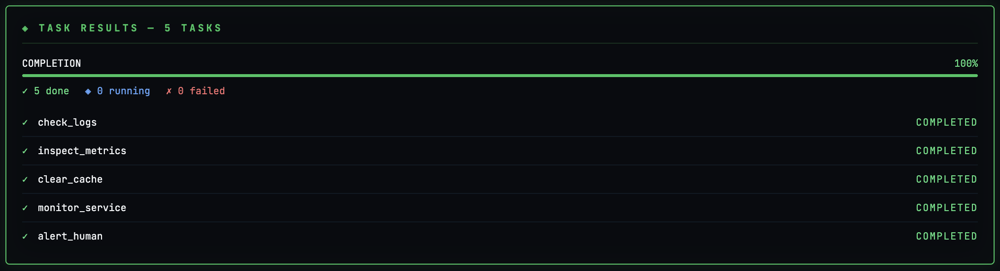
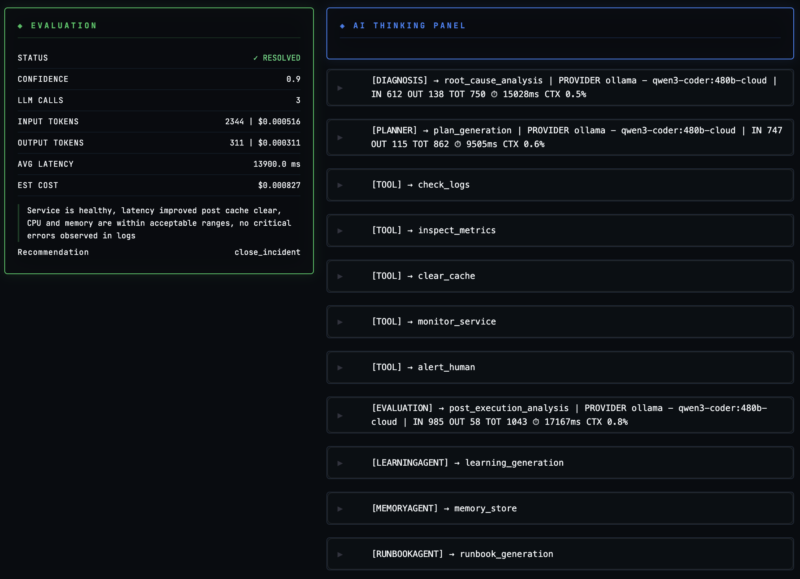

# 🚨 Sentinel AI — Autonomous Incident Response System

**An autonomous SRE incident-response platform that detects production issues, diagnoses root causes, executes remediation actions, and evaluates outcomes using multi-agent AI workflows.**

Designed to simulate how modern reliability teams can leverage AI for real operational automation.

---

## 🔥 Overview

Sentinel AI is a real-world production incident response system powered by LLM agents and intelligent orchestration.

**It mimics how modern SRE teams operate:**

```
Incident → Diagnosis → Planning → Execution → Evaluation → Learning
```

### System Properties

- **Autonomous** — Closed-loop decision making with self-correction
- **Observable** — Comprehensive metrics (cost, latency, tokens tracked)
- **Auditable** — Full reasoning trace and execution history
- **Extensible** — Plugs into real infra (Kubernetes, AWS, etc.)

Combines agentic reasoning, workflow orchestration, observability, memory retrieval, and dynamic tool execution through MCP.

---

### ✨ What This Project Demonstrates

This project showcases:

- Multi-agent AI system architecture
- Autonomous workflow orchestration
- MCP-based distributed tool execution
- Shared execution state across agents
- AI observability (cost, latency, token usage)
- Evaluation-driven decision loops
- Production-style incident automation patterns

---

## 🧠 Core Capabilities

### 🤖 Multi-Agent Architecture

Sentinel AI uses specialized agents working together:

- **Diagnosis Agent** → Identifies likely root cause
- **Planner Agent** → Builds remediation DAG
- **Executor Agent** → Runs tools and actions
- **Evaluator Agent** → Scores outcome quality and decides next steps
- **Memory Agent** → Retrieves similar past incidents
- **Risk Agent** → Enforces safety guardrails
- **Learning Agent** → Improves future workflows

---

### ⚙️ Intelligent Execution Engine

- **DAG-based execution planning** — Structured remediation workflows
- **LangGraph-like workflow** — Explicit state management and transitions
- **Parallel diagnostics + sequential remediation** — Efficient resource usage
- **Retry & fallback strategies** — Resilient action execution
- **Tool abstraction layer** — Infra-agnostic design

---

### 🧰 MCP Tool Execution Layer

Sentinel AI uses an **MCP-backed tool server** with a **generalized client**.

This enables clean separation:

```
LLM / Agents → Decision Making
      ↓
   MCP Tools → Action Execution
```

**Supported SRE Actions:**

- `check_logs` — Analyze system logs for errors
- `inspect_metrics` — Review CPU, memory, disk metrics
- `restart_container` — Restart a service container
- `monitor_service` — Track service health and latency
- `check_health_endpoint` — Verify service availability
- `scale_service` — Auto-scale services up/down
- `clear_cache` — Improve performance by clearing caches
- `rollback_deployment` — Revert to previous stable version
- `alert_human` — Escalate to human operators
- `close_incident` — Mark incident as resolved

**Benefits of MCP Integration:**

- Decoupled tool architecture
- Reusable tool services across workflows
- Remote/distributed execution support
- Easier authentication, retries, and versioning
- Scalable infrastructure integrations

---

### 💾 Memory-Augmented Diagnosis

Retrieves similar past incidents using vector similarity to improve root cause analysis:

- **Similar incident recall** — Fetch relevant historical cases
- **Historical outcomes** — Learn from past solutions
- **Relevance-based reasoning** — Weight similar cases by relevance
- **Improved accuracy over time** — System gets smarter with experience

#### 📊 Task Execution Dashboard

<p align="center">
  
  <br/>
  <em>Real-time task execution visualization dashboard</em>
</p>

---

### 📊 Observability & Metrics

Tracks both AI and system-level metrics:

- **Token usage** — LLM input/output tokens
- **Model latency** — Time per LLM call
- **Cost per execution** — Estimated execution cost
- **Tool latency** — Performance of each action
- **Success rate** — Incident resolution rate
- **Evaluation score** — Quality of remediation

---

### 🔍 Evaluation Engine (Core Innovation)

Instead of binary "resolved / unresolved", Sentinel AI evaluates:

- **Issue resolution quality** — Did we fix the root cause?
- **System stability** — Is the system stable now?
- **Remediation effectiveness** — How well did actions work?
- **Execution efficiency** — Did we minimize resources?
- **Confidence alignment** — Are agent decisions justified?

This creates a **self-correcting feedback loop** that improves over time.

#### 🧠 Evaluation & Thinking Panel

<p align="center">
  
  <br/>
  <em>Evaluation & AI Thinking Panel observability visualization</em>
</p>

---

### 📜 Full Audit Trail

Every execution is fully traceable:

- **Agent decisions** — What did each agent decide and why?
- **Execution DAG** — Visual workflow of actions
- **Tool outputs** — Results from each action
- **Reasoning steps** — Step-by-step logic traces
- **Evaluation outcomes** — Scoring and quality metrics
- **Retries / failures** — Complete failure history

**Ideal for:** Debugging, compliance audits, and execution replay.

---

### 🖥️ Interactive Dashboard (Streamlit)

Real-time visualization including:

- **Execution DAG** — Visual workflow diagram
- **Step-by-step agent flow** — Agent progression
- **Tool outputs** — Action results and metrics
- **Evaluation panel** — Quality scoring details
- **LLM usage** — Tokens, latency, and cost tracking

---

## 🏗️ Architecture

```
					┌────────────────────┐
					│   Streamlit UI     │
					└────────┬───────────┘
							 ↓
					┌────────────────────┐
					│   FastAPI Backend  │
					└────────┬───────────┘
							 ↓
          ┌────────────────────────────────────────┐
          │    Orchestration / Workflow Engine     │
          │   (LangGraph-like DAG + state mgmt)    │
          └────────────────────────────────────────┘
               ↓          ↓          ↓          ↓
            Diagnosis   Planner   Executor   Evaluator
               ↓          ↓          ↓
             Memory      DAG     MCP Client
               ↓                     ↓
          Vector Store           MCP Tool Server
               ↓                     ↓
          Redis State + Streams  Simulated / Real Infra
```

---

## 🧱 Tech Stack

| Component | Technology |
|-----------|-----------|
| **Backend** | FastAPI |
| **Workers** | Celery |
| **State Store** | Redis |
| **Database** | PostgreSQL |
| **UI** | Streamlit |
| **AI Models** | Multi-provider LLM Router |
| **Tool Protocol** | MCP (Model Context Protocol) |
| **Containerization** | Docker |

---

## 🚀 Getting Started

### Prerequisites

- [Docker](https://www.docker.com/get-started) installed on your machine
- [Git](https://git-scm.com/) installed

### Setup & Run

#### 1. Clone the Repository

```bash
git clone https://github.com/pramodgithub/sentinel-ai.git
cd sentinel-ai
```

#### 2. Start the Project

**Run with build:**
```bash
docker compose up --build
```

**Run in background:**
```bash
docker compose up --build -d
```

#### 3. Stop the Project

```bash
docker compose down
```

### Useful Commands

```bash
# View all logs
docker compose logs -f

# View logs for specific service
docker compose logs -f celery_worker

# Restart a specific service
docker compose restart <service_name>

# Rebuild a specific service
docker compose up --build <service_name>
```

---

## 🧪 Demo Scenarios

The system includes prebuilt incident simulations:

- **High CPU Spike** — Excessive CPU usage triggers scaling
- **Service Down** — Complete service failure workflow
- **Memory Leak** — Progressive memory increase detection
- **Error Rate Spike** — Sudden error threshold breach
- **False Alert** — System validation of alert accuracy
- **Restart Failure** — Handles failed restart attempts
- **Performance Drift** — Gradual performance degradation
- **Cache Issue** — Cache-related performance problems
- **Bad Deployment** — Faulty deployment recovery
- **High Risk Escalation** — Human escalation workflow

Each scenario:
- Triggers different agent workflows
- Tests different tool combinations
- Generates unique audit logs and traces

---

## 🔐 Safety & Guardrails

- **RBAC-ready tool execution** — Role-based access control
- **Human escalation for high-risk actions** — Safety thresholds
- **Audit logging for all decisions** — Complete compliance trail
- **No direct infra execution** — All actions go through MCP

---

## 🧠 Design Principles

- **Tool Abstraction** — Decouple decision from execution
- **Closed Loop** — Evaluate → Retry → Adapt continuously
- **Memory-Driven Intelligence** — Learn from past incidents
- **Explainability First** — Full reasoning traces available
- **Production Readiness** — Designed for real-world patterns (simulated)

---

## 🔮 Future Enhancements

- **Kubernetes / AWS real integration** — Connect to real infrastructure
- **Multi-model comparison** — GPT vs. open source models
- **Advanced drift detection** — Predictive anomaly detection
- **Policy-based guardrails** — Custom safety policies
- **Cost-aware planning** — Optimize resource usage

---

## 🎯 Why This Project Matters

This project demonstrates:

- **Agentic AI system design** — Multi-agent coordination patterns
- **Real-world SRE automation patterns** — Production-grade reliability
- **LLM evaluation & observability** — Measuring AI quality
- **Scalable orchestration architecture** — Enterprise patterns

The codebase is a reference implementation for building autonomous systems that can reason, plan, execute, and learn from complex operational workflows.

---

## 🎯 Scaling - Full AWS Architecture

Internet
    │
    ▼
ALB (public)
    ├── /api/*  → FastAPI EC2 x2 (target group)
    └── /mcp/*  → MCP Server EC2 x2 (target group)
                        │
                        ▼
              ElastiCache Redis
                        │
              ┌─────────┴──────────┐
              ▼                    ▼
    Celery Worker EC2 x3     RDS Primary
                                   │
                             RDS Read Replica


**AWS Services replacing local containers**

**redis**	- ElastiCache (Redis)	- Managed auto-failover, no cluster needed for moderate load
**postgres**	- RDS Postgres	- Managed backups, read replicas, multi-AZ
**nginx/LB**	- ALB (Application Load Balancer)	- Routes to FastAPI and MCP instances

**Redis — without cluster**
Single ElastiCache node is fine if you don't need HA. Just update the URL:
```
# .env
REDIS_URL=redis://sentinel-redis.abc123.cache.amazonaws.com:6379
```
Your Celery config picks this up:
```
	# celery_app.py
	import os
	broker_url = os.getenv("REDIS_URL")
	result_backend = os.getenv("REDIS_URL")
```

**Postgres — Primary + Read Replica**
**RDS setup:**

1 Primary — handles all writes
1 Read Replica — handles all reads

Replace the docker-compose.yml from folder
	app
	--scale
	  -- docker-compose.yml
	  -- Dockerfile.api	
	  -- Dockerfile.mcp
	  -- Dockerfile.worker


---

## 👨‍💻 Author & Contributions

Built as part of advanced exploration into:

- AI systems architecture and design
- Autonomous workflow orchestration
- Production-grade LLM applications

---

## ⭐ Show Your Support

If you find this project useful:

- Give it a **star** ⭐ on GitHub
- Use it as inspiration to build something even more powerful
- Share feedback and improvements

---

**Happy incident resolving! 🚀**
